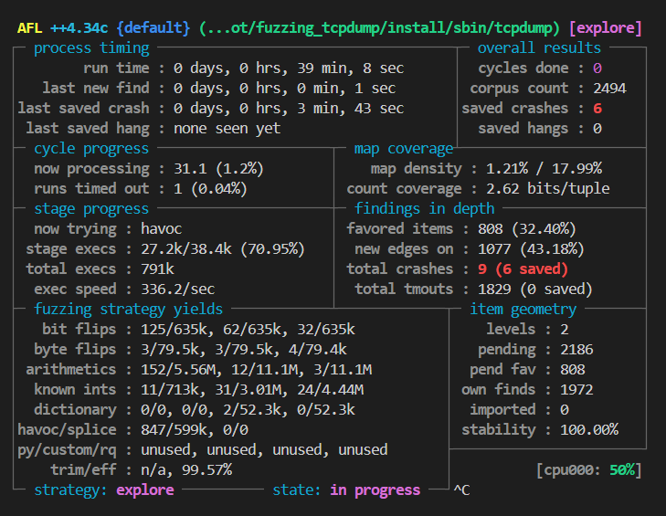

# 🛠 Exercise 3 Fix Report: TCPdump CVE-2017-13028

## Vulnerability Background

- **Target Version**: TCPdump 4.9.1  
  *(Note: Fuzzing101 recommends version 4.9.2, which already includes the official fix. For reproducibility and analysis, version 4.9.1 was used.)*

- **Vulnerability ID**: CVE-2017-13028

- **Vulnerability Type**: Global Buffer Overflow (Out-of-Bounds Read)

- **Trigger Condition**: Crafting a specific BOOTP packet can cause TCPdump to read beyond the bounds of a statically allocated buffer.

- **Impact**: May lead to denial of service (crash) or potential information leakage.

---

## Vulnerability Analysis Process

1. Performed fuzzing on TCPdump using AFL++ targeting the BOOTP protocol parsing path.
2. Collected 6 unique crashing inputs, all triggering faults in the `bittok2str_internal()` function located in `util-print.c`.

3. Upon inspection, identified that `bittok2str_internal()` used a statically allocated buffer (`static char buf[256]`) to construct formatted flag strings.

<details>
<summary>bittok2str_internal function</summary>

```C
/*
 * Convert a bit token value to a string; use "fmt" if not found.
 * this is useful for parsing bitfields, the output strings are seperated
 * if the s field is positive.
 */
static char *
bittok2str_internal(register const struct tok *lp, register const char *fmt,
       register u_int v, const char *sep)
{
        static char buf[256]; /* our stringbuffer */
        int buflen=0;
        register u_int rotbit; /* this is the bit we rotate through all bitpositions */
        register u_int tokval;
        const char * sepstr = "";

    while (lp != NULL && lp->s != NULL) {
            tokval=lp->v;   /* load our first value */
            rotbit=1;
            while (rotbit != 0) {
                /*
                 * lets AND the rotating bit with our token value
                 * and see if we have got a match
                 */
        if (tokval == (v&rotbit)) {
                    /* ok we have found something */
                    buflen+=snprintf(buf+buflen, sizeof(buf)-buflen, "%s%s",
                                     sepstr, lp->s);
                    sepstr = sep;
                    break;
                }
                rotbit=rotbit<<1; /* no match - lets shift and try again */
            }
            lp++;
    }

        if (buflen == 0)
            /* bummer - lets print the "unknown" message as advised in the fmt string if we got one */
            (void)snprintf(buf, sizeof(buf), fmt == NULL ? "#%08x" : fmt, v);
        return (buf);
}
```

</details>

4. The function used `snprintf()` to append strings, but lacked bounds checking. When the accumulated `buflen` exceeded 256 bytes, subsequent writes caused out-of-bounds memory access, triggering `global-buffer-overflow` errors under AddressSanitizer.


---

## Fix Strategy

1. **Dynamic Buffer Allocation**  
   Replaced the static buffer with a dynamically allocated one using `malloc()`. Before each write, checked whether the buffer had sufficient capacity. If not, used `realloc()` to expand the buffer safely.

<details>
<summary>fixed bittok2str_internal</summary>

```C   
/*
 * Convert a bit token value to a string; use "fmt" if not found.
 * this is useful for parsing bitfields, the output strings are seperated
 * if the s field is positive.
 */
static char *
bittok2str_internal(register const struct tok *lp, register const char *fmt,
	   register u_int v, const char *sep)
{
        // static char buf[256]; /* our stringbuffer */
		char *buf=malloc(256);//use dynamic buffer
		int bufcap=256;

        int buflen=0;
        register u_int rotbit; /* this is the bit we rotate through all bitpositions */
        register u_int tokval;
        const char * sepstr = "";

	while (lp != NULL && lp->s != NULL) {
            tokval=lp->v;   /* load our first value */
            rotbit=1;
            while (rotbit != 0) {
                /*
                 * lets AND the rotating bit with our token value
                 * and see if we have got a match
                 */
		if (tokval == (v&rotbit)) {
                    /* ok we have found something */

					while(buflen+strlen(sepstr) + strlen(lp->s) + 1 >=bufcap){ // +1 for null terminator
						bufcap*=2;
						buf=realloc(buf,bufcap);
						if (!buf) {
							perror("realloc failed");
							exit(1);
						}
					}
                    buflen+=snprintf(buf+buflen, bufcap-buflen, "%s%s",
                                     sepstr, lp->s);

                    sepstr = sep;
                    break;
                }
                rotbit=rotbit<<1; /* no match - lets shift and try again */
            }
            lp++;
	}

        if (buflen == 0)
            /* bummer - lets print the "unknown" message as advised in the fmt string if we got one */
            (void)snprintf(buf, sizeof(buf), fmt == NULL ? "#%08x" : fmt, v);

        return (buf);
}
```

</details>

2. **Memory Lifecycle Management**  
   Updated all final callers of `bittok2str()` and `bittok2str_nosep()` to explicitly `free()` the returned buffer after use, ensuring no memory leaks.

---

## Verification Results

- Recompiled TCPdump with the patched `bittok2str_internal()` implementation.
- Re-ran all previously crashing BOOTP samples.
- No crashes observed; AddressSanitizer and LeakSanitizer reports were clean.

- Fix confirmed effective and stable.
