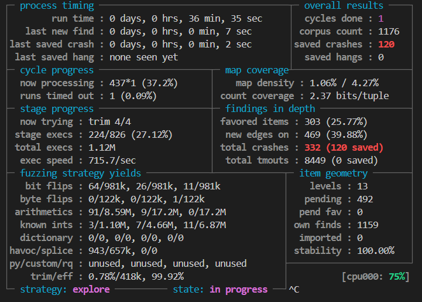
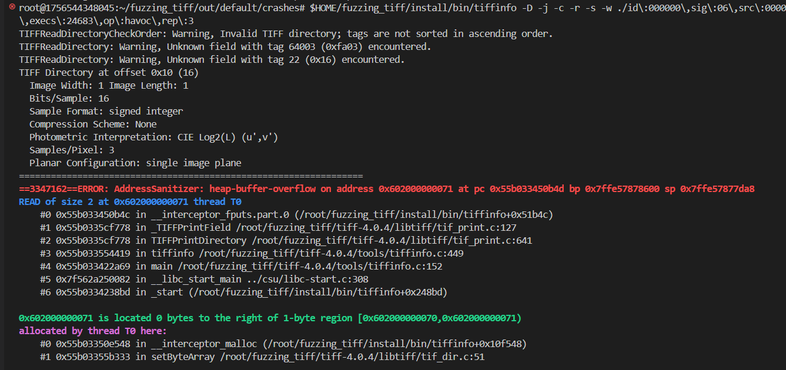
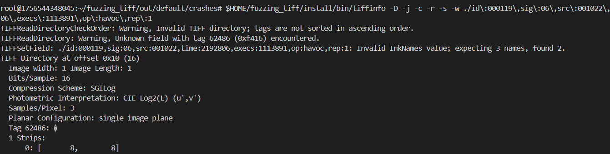

# Exercise 4 Fix Report: LibTIFF `_TIFFPrintField()` ASCII Print Overflow

## Vulnerability Overview

- **Target Version**: LibTIFF 4.0.4

- **Vulnerability Type**: Heap Buffer Overflow (Out-of-Bounds Read)

- **Trigger Condition**: A malformed TIFF tag of type `TIFF_ASCII` with no null terminator causes `_TIFFPrintField()` to read beyond the allocated buffer when printing.

- **Impact**: May lead to denial of service (crash) or potential information leakage when printing tag values.

---

## Vulnerability Analysis

1. Fuzzing was performed using AFL++ targeting the `tiffinfo` binary with ASan enabled.
2. Multiple crashing inputs were collected, all triggering faults in the `_TIFFPrintField()` function.



3. The function attempts to print `TIFF_ASCII` fields using `fprintf(fd, "%s", raw_data)`, assuming `raw_data` is a null-terminated string.


4. However, fuzzed inputs may violate this assumption:
   - `value_count` may be small (e.g., 1)
   - `raw_data` may lack a `\0` terminator
   - `fprintf()` continues reading until it hits a `\0`, causing heap-buffer-overflow
   


```c
else if (fip->field_type == TIFF_ASCII) {
    fprintf(fd, "%s", (char *) raw_data); // unsafe if raw_data lacks '\0'
    break;
}
```

---

## Fix Strategy

### Replace `fprintf()` with `fwrite()` for ASCII fields

To avoid relying on null termination, the fix uses `fwrite()` to write exactly `value_count` bytes:


```c
else if (fip->field_type == TIFF_ASCII) {
    fwrite(raw_data, 1, value_count, fd); // safe: bounded write
    break;
}
```


- `fwrite()` writes a fixed number of bytes, avoiding out-of-bounds reads.

---

## Verification Results

- Recompiled LibTIFF with the patched `_TIFFPrintField()` implementation.
- Re-ran all previously crashing samples using `tiffinfo`.
- No crashes observed; AddressSanitizer reports clean.



- Output remains consistent with expected tag values.
